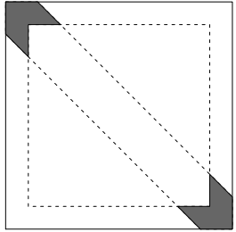

```{r setup, include=FALSE}
knitr::opts_chunk$set(echo = TRUE)
```

# Références pour la simulation de loi sous `R` {-}

`R` dispose d'un ensemble de fonctions pour générer les lois usuelles (multinomiale avec `sample`, loi uniforme avec `runif`, loi normale avec `rnorm`, etc \dots).

En plus de l'aide de ces fonctions (`help(rnorm)`, par exemple), on pourra se reférer à la partie 5 du [polycopié de Christophe Chesneau](https://cel.archives-ouvertes.fr/cel-01389942/document).

# Première implémentation

On cherche à évaluer la valeur de l'intégrale suivante:

$$I = \int_{\mathbb{R}^2}\cos^2(x)  \sin^2(3 y)  \exp(-(x^2 + y^2))\text{d}x\text{d}y$$

1. Ecrire un estimateur de Monte Carlo, noté $\hat{I}_M$ (où $M$ est l'effort Monte Carlo) pour cette intégrale.

2. À l'aide du logiciel `R`, donnez une estimation de la valeur de cette intégrale pour un effort de Monte Carlo $M = 10000$. Pour simuler une loi normale sous `R`, vous utiliserez la fonction `rnorm` (voir `help(rnorm)`).

3. Quelle est la variance de $\hat{I}_1$? À l'aide des simulations obtenues précedemment, obtenez une estimation de cette variance. Servez vous de cette estimation pour calculer un intervalle de confiance asymptotique à 95% pour I.

4. Représentez graphiquement l'évolution de votre estimation en fonction de $M$ ainsi que l'intervalle de confiance associé.

# Aiguille de Buffon

Au XVIIIe siècle,  naturaliste Georges Louis Leclerc de Buffon pose le problème suivant:

On considère un parquet avec une infinité de lattes de longueurs infinies, toutes de largeur 1.
On considère ensuite l'expérience suivante:
On jette une aiguille de longueur 1 en l'air, qui retombe ensuite sur le parquet.
On cherche alors à calculer la probabilité que l'aiguille croise le bord d'une des lattes.

Le centre de l'aiguille tombant toujours entre deux lattes, on notera $X$ la variable aléatoire correspondant à son ordonnée (on visualisera les lattes comme disposées "horizontalement"), comprise entre 0 et 1.

On notera $\theta$ l'angle formé par l'aiguille avec l'horizontale. $\theta$ est donc compris entre 0 et $\frac{\pi}{2}$.

On suppose que $X$ et $\theta$ sont deux variables aléatoires indépendantes distribuées selon des lois uniformes sur $[0, 1]$ et $[0 ,\frac{\pi}{2}]$ respectivement.

1. Montrer que la probabilité qu'une aiguille croise une latte dans ces conditions est de
$\frac{2}{\pi}$.
2. Proposer un estimateur Monte Carlo de cette probabilité.
3. En déduire un estimateur de Monte Carlo de la valeur de $\pi$.
4. Donner un intervalle de confiance asymptotique à 95% pour cet estimateur.
5. Sur `R`, tracez, en fonction du nombres de simulation de Monte Carlo, l'estimation de $\pi$ trouvée.
6. La vitesse d'approximation de $\pi$ vous semble t'elle bonne?

# Une comparaison avec l'intégration numérique

Cet exercice est une adaptation de l'exercice 1.2 de ce [cours en ligne](https://statweb.stanford.edu/~owen/mc/Ch-intro.pdf).

On se place dans l'hypercube unitaire de dimension $d$, autrement dit, l'espace $[0, 1]^d$,
pour $d \geq 2$.

Soit $0 < \varepsilon < 1/2$, on s'intéresse à évaluer le volume d'une sous région de cette hypercube, à savoir:
$$A_{\varepsilon, d}\cap B_{\varepsilon, d}$$
où 

- $A_{\varepsilon, d}$ est l'ensemble des points du cube étant à une distance du bord plus petite que $\varepsilon$. Formellement:
$$A_{\varepsilon, d} = \left\lbrace x \in [0, 1]^d, \underset{1\leq j \leq d}{\min}\min (x_j, 1 - x_j) < \epsilon \right\rbrace$$
- $B_{\varepsilon, d}$ est l'ensemble des points du cube étant à une distance de l'hyperplan $\left\lbrace x \in \in [0, 1]^d, \sum_{j = 1}^d x_j = \frac{d}{2} \right\rbrace$ plus petite que $\varepsilon$. Formellement:
$$B_{\varepsilon, d} = \left\lbrace x \in [0, 1]^d, \frac{1}{\sqrt{d}}\left\vert \sum_{j=1}^d (x_j - \frac{1}{2}) \right\vert < \epsilon \right\rbrace$$



1. Justifier que le volume considéré grandit avec $d$. *On pourra justifier que le premier volume tende vers 1 quand $d\rightarrow \infty$ et que le second se stabilise vers une valeur finie*. 
*L'argument pour le premier volume est purement géométrique, l'argument pour le second peut se déduire du TCL*.

2. Ecrire le volume recherché sous forme d'une intégrale. En déduire un estimateur Monte Carlo de ce volume.

3. Donner une estimation de ce volume pour $\varepsilon = 0.1$ et $d = 2, 5, 10, 20$. Vous choisirez vous même l'effort de Monte Carlo, en justifiant ce choix. Donnez l'incertitude associée à votre estimation.

4. À l'aide de la fonction `hcubature` du package `cubature`, donnez une valeur du volume obtenue par approximation numérique pour les mêmes valeurs de $d$.

5. Comparez les résultats et commentez.

# Cas des évènements rares

On se propose d'étudier l'erreur relative de l'estimateur de Monte Carlo de la probabilité $p$ d'un événement $E$ ($0 < p \leq 1$), en fonction de la valeur de $p$. 

On se place dans le cas où pour estimer $p$, on simule $n$ variables aléatoires  indépendantes $X_1,\dots, X_n$ de loi de Bernouilli de paramètre $p$.

L'estimateur de Monte Carlo de $p$ est donné par $$\hat{p} = \bar{X}_n = \frac{1}{n}\sum_{i = 1}^n X_i$$
On s'intéresse à l'erreur relative de $\hat{p}$, à savoir la quantité:
$$\Delta_p = \frac{\hat{p} - p}{p}$$

1. Calculer la variance de $\Delta_p$.
2. Pour $0 < \alpha < 1$, exprimer $\mathbb{P}(|\Delta_p| > \alpha)$ exactement en fonction de la loi d'une variable aléatoire binomiale de paramètres $(n, p)$. Que pouvez vous conjecturer sur cette probabilité quand $p$ devient petit?
3. En utilisant le théorème central limite, donner une expression asymptotique de cette probabilité basée sur la fonction de répartition de la loi normale centrée réduite.

## Attention à la dimension!

4. On peut montrer que le volume d'une sphère de rayon 1 en dimension $d\geq 2$ est donné
par la fonction:
$$V(d) = \frac{\pi^{d / 2}}{\Gamma(\frac{d}{2} + 1)}$$
où, pour $z>0$
$$\Gamma(z) = \int_0^\infty t^{z-1} e^{-t} d t$$
On se propose d'estimer la valeur de $\pi$ en tirant, en dimension $d$, une $U$ variable uniforme dans l'hypercube $[-1, 1]^d$. On pose alors $X = \mathbf{1}_{\parallel U \parallel^2 \leq 1}$, sur un échantillon de taille $n = 10000$. 

    a. Quelle est la valeur de $p$, le paramètre de la loi de Bernouilli de $X$?
    b. Donner alors l'estimateur de $\pi$ en fonction de l'estimateur de $p$.
    c. Discutez la qualité de l'estimateur quand $d$ grandit. Vous pourrez vous aidez de R pour voir le comportement de la fonction $V_d$ (en pourra utiliser la fonction `gamma` dans R).
    
# Détection d'aggrégats dans une série temporelle

## Présentation du problème 

On s'intéresse à une série temporelle à valeurs dans $\mathbb{R}$. Ainsi, les données
consistent en un vecteur $X_{1:n} = (X_1,\dots X_n)$ de valeurs ordonnées dans le temps.

La question est la suivante: *Existe-t-il une fenêtre temporelle de valeurs anormalement élevées?*.

Pour cela, on se propose de faire le test 

- $H_0$: Les variables aléatoires $X_1,\dots, X_n$ sont indépendantes et identiquement distribuées.
- $H_1$: Il existe une fenêtre temporelle où les valeurs de la série sont plus importantes.

Pour tester cette hypothèse, pour une série temporelle $X_{1:n} = (X_1,\dots, X_n)$, on va définir une statistique de test $T(X_{1:n})$. 


Pour l'échantillon aléatoire $X_1,\dots X_n$, on note $R_k$ le rang de $X_k$ parmi les valeurs de l'échantillon (il est égal à 1 si $X_k$ est la valeur la plus faible, à $n$ si $X_k$ est la valeur la plus élevée). 
Comme on considère des variables aléatoires continues, on considère dans la suite que deux rangs ne peuvent pas être égaux. 
**Vous remarquerez que l'hypothèse H0 ne fait pas d'hypothèse sur la distribution des valeurs observées, en effet, H0 fait une hypothèse sur la distribution jointe des rangs**.

1. Justifier que, sous $H_0$, la loi de $R_k$ est une loi uniforme discrète sur 
$\left\lbrace 1,\dots,n\right\rbrace$. Quelle est la loi de $R_k$ sachant $R_\ell$ ($\ell\neq k$)? 

Pour tout couple $(i, j)$ tel que $1 \leq i\leq j\leq n$ on considère la variable aléatoire suivante:

$$S(i, j) = \sum_{k = i}^j R_k.$$

2. Que représente cette variable aléatoire? Dans quel cas prendra t'elle des grandes valeurs?
  
3. Montrer que, sous $H_0$, $m_{ij} := \mathbb{E}[S(i,j)] = \frac{1}{2}(n+1)(j-i+1)$ pour tout couple  $(i,j)$.
  
4. Calculer, sous $H_0$, $v_{ij} :=  \mathbb{V}[S(i,j)] =  \frac{1}{12}(n+1)(j-i+1)(n-j+i-1)$ pour tout couple $(i,j)$.
  
On définit maintenant la variable aléatoire centrée et réduite, pour tout couple d'entiers
 $(i, j)$ tel que $1 \leq i\leq j\leq n$.
$$T(i, j) = \left\lbrace \begin{array}{lr}
0&\text{ si } i = 1 \text{ et } j = n\\
\frac{S(i, j) - m_{ij}}{\sqrt{v_{ij}}} & \text{ sinon.} 
\end{array}
\right.$$

Notre statistique de test $T_n(X_{1:n})$ sera donc donnée par 
\begin{equation}
\label{eq:stat:T}
T_n(X_{1:n}) = \underset{1 \leq i\leq j\leq n}{\text{max}} T(i, j).
\end{equation}

## Principe du test et prise de décision par méthode de Monte Carlo.

Le principe du test est le suivant: pour un échantillon observé $\mathbf{x}$ un risque $\alpha$, on rejette $H_0$ si $T_n(\mathbf{x}) > t_{1 - \alpha}$ où $t_{1 - \alpha}$ est le quantile d'ordre $\alpha$ de la loi de $T_n(\mathbf{X})$. 
On concluera que la fenêtre temporelle pour laquelle la statistique est calculée (soit $(i_{\text{max} },j_{\text{max}}) = \text{argmax}_{i,j}~T(i,j)$) est anormalement loin de 0 sous $H_0$. 
On rejettera alors $H_0$ pour conclure a un aggrégat de valeurs élevées sur cette fenêtre.

5. La loi de $T_n$ sous $H_0$ étant inconnue, on se propose d'approcher ses quantiles sous $H_0$ par méthode de Monte Carlo. 
Donner un algorithme simple de simulation de $T_n$ sous $H_0$.

6. Proposer une méthode de Monte Carlo pour répondre à la question initiale à un risque $\alpha$ fixé,  pour n'importe quelle série temporelle observée $x_{1:n}$.

## Implémentation sous R pour les températures à Hobart, Tasmanie.

7. Ecrire une fonction `get_tn`, qui pour une série temporelle $x_{1:n}$ donnée, calcule $T_n(x_{1:n})$ et, si on le demande, renvoit les indices temporels de la fenêtre sur laquelle cette statistique est obtenue. Calculer cette statistique de test pour la série des températures à Hobart. On notera cette valeur $t^*$

8. Ecrire une fonction `get_h0_sample` qui, pour un entier $n$ et un entier $M$ permet 
d'obtenir $M$ réalisations de $T_n$ sous $H_0$.

9. Simuler un $M$ échantillon de $T_n$ sous $H_0$ pour une valeur de $n$ correspondant
à celles des données d'Hobart. Vous prendrez $M = 5000$. 
Représenter l'estimation obtenue de $\mathbb{P}(T_n > t^*)$ ainsi que son intervalle de confiance asymptotique à 95%. 

10. Répondre à la question initiale sur les températures à Hobart
