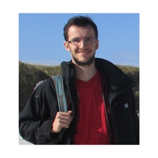

 </img>
  
  
After obtaining my PhD in statistical modelling at the French research instiute for the sea (IFREMER) in 2015, I have been an assitant professor in Statistics at Agroparistech since 2018.

My teaching mainly focuses on statistical modelling for experimental sciences, starting with the linear model and its extensions, and ending with Markov processes for models in biology and ecology. 

My research focuses on designing inference algorithms for statistical learning. These algorithm are designed for continuous time models (stochastic differential equations) and state space models (hidden Markov models). I work on applications in environmental sciences and ecology. 