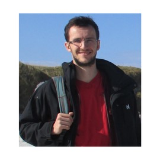

```{r}
#| label: photo
#| echo: false


```


  
After obtaining my PhD in statistical modelling at the French research instiute for the sea (IFREMER) in 2015, I was an assitant professor in Statistics at Agroparistech (Paris) from 2018 to 2023, and I have been assistant professor in Statistics at Université Bretagne-Sud (Vannes) since 2023.

### Research

My research focuses on:

- Inference algorithms for statistical learning.  These algorithm are designed for continuous time models (stochastic differential equations) and state space models (hidden Markov models).
- Physics informed machine learning.
- Statistical ecology:
    - Models in movement ecology;
    - Joint species distribution models;
    - Design of experiments in ecology.

### Teaching 

My teaching mainly focuses on statistical modelling for experimental sciences, starting with the linear model and its extensions, and ending with Markov processes for models in biology and ecology. 