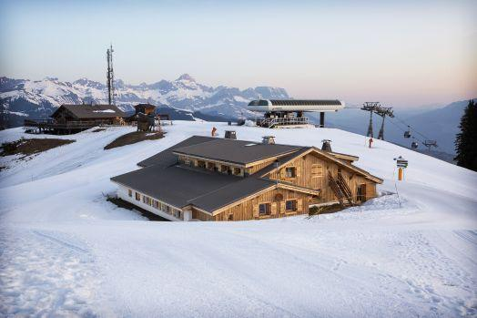

```{r}
#| label: image-rochebrune
#| echo: false


```


L'équipe [SOLsTIS](https://mia-ps.inrae.fr/solstis) de l'unité MIA Paris Saclay organise tous les deux ans au mois de Mars son workshop bi-annuel **Statistiques au sommet de Rochebrune**.

### Lieu 


Ce workshop a lieu dans un cadre exceptionnel, au [chalet de l'Asma](https://www.asma-nationale.fr/com/page/2817), qui se situe au sommet de Rochebrune (Megève). 


### Le comité d'organisation 

- *2026*: [Lucia Clarotto](https://mia-ps.inrae.fr/lucia-clarotto) et [Pierre Gloaguen](https://papayoun.github.io/). 
- *2022-2024:* [Sophie Donnet](https://mia-ps.inrae.fr/sophie-donnet) et [Pierre Gloaguen](https://papayoun.github.io/). 
- *Avant 2022:*  [E. Parent](https://mia-ps.inrae.fr/eric-parent).

### Les participant.e.s 

Entre 30 et 40 participant.e.s, chercheur.e.s débutant.e.s ou confirmé.e.s se retrouvent tous les deux ans pour suivre un cours,  présenter leurs travaux en cours et en discuter, dans une ambiance chaleureuse et conviviale. 


## Edition 2026 (22 au 26 Mars)

- Cette année, le cours sera donné par [Gabriel V. Cardoso](https://gabrielvc.github.io/) et portera sur les modèles génératifs et leur usage pour la définition de priors en inférence bayésienne.
- L'intégralité des exposés ainsi que le programme de l'édition 2026 est disponible [sur cette page](programmes/26_programme_final.html). 
  


### Programmes des éditions précédentes

 - [Programme 2024](programmes/24_programme_final.html).  **Cours** par [P. Gloaguen](https://papayoun.github.io), [Pierre Barbillon](https://mia-ps.inrae.fr/pierre-barbillon), [Hugo Gangloff](https://hgangloff.github.io/) et [Stéphanie Mahévas](https://umr-marbec.fr/membre/stephanie-mahevas/).

 - [Programme 2022](programmes/programme_rochebrune_2022.pdf).  **Cours** par [D. Allard](https://biosp.mathnum.inrae.fr/homepage-denis-allard) , [T. Opitz](https://biosp.mathnum.inrae.fr/homepage-thomas-opitz) et [L. Clarotto](https://mia-ps.inrae.fr/lucia-clarotto).
 
 - Programme 2020 (cette édition a eu lieu en ligne en 2021). **Cours** de [D. Allard](https://biosp.mathnum.inrae.fr/homepage-denis-allard) , [T. Opitz](https://biosp.mathnum.inrae.fr/homepage-thomas-opitz) sur INLA et la modélisation statistique pour les données spatialisées
 
 - [Programme 2018](programmes/progroch2018.pdf)  **Cours** par [J. Arbel](https://www.julyanarbel.com/) sur les processus de Dirichlet et l'inférence bayésienne non paramétrique
 
 - [Programme 2016](programmes/progroch2016.pdf) **Cours** par L. Schwaller sur les modèles graphiques
 - Programme 2014 **Cours** par [S. Le Corff](https://sylvainlc.github.io/) sur les filtres particulaires

